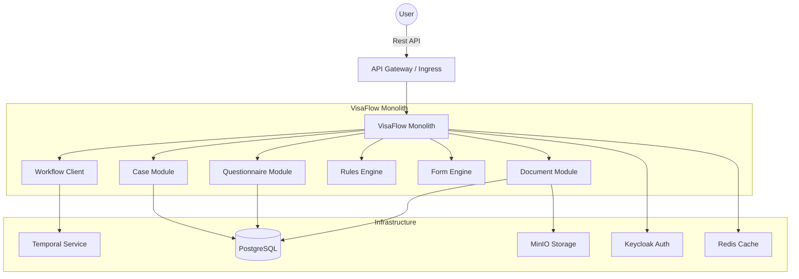

# 🦅 VisaFlow MVP

**VisaFlow** is a next-gen SaaS LegalTech platform designed to automate US visa application processes (specifically I-130). We eliminate administrative errors, ensure data consistency, and generate production-ready submission packages.

---

## 🛠️ Tech Stack & Architecture

VisaFlow is built on a **Modular Monolith** architecture, designed for scalability, maintainability, and clean separation of concerns.

### Core Backend
| Technology | Badge | Description |
|------------|-------|-------------|
| **Language** |  | Core language, leveraging records & patterns. |
| **Framework** |  | Application framework (Web, Data, Security). |
| **Build Tool** |  | Dependency management & build automation. |

### Data & Infrastructure
| Technology | Badge | Description |
|------------|-------|-------------|
| **Database** |  | Relational persistence for cases & metadata. |
| **Storage** |  | Secure object storage for documents. |
| **Caching** |  | High-performance caching. |

### Security & Orchestration
| Technology | Badge | Description |
|------------|-------|-------------|
| **Identity** |  | OIDC Authentication & RBAC. |
| **Workflow** |  | Durable execution for long-running processes. |
| **Docs** |  | API Documentation & Testing. |

### Modules Overview
- 🧠 **`visaflow-core`**: Shared kernel, domain primitives.
- 🏗️ **`visaflow-infra`**: Infrastructure configuration.
- 📂 **`visaflow-case`**: Case management domain.
- 📝 **`visaflow-questionnaire`**: Dynamic forms & validation.
- 📄 **`visaflow-document`**: Document metadata & MinIO integration.
- 📏 **`visaflow-rules`**: Deterministic rule engine.
- 🔄 **`visaflow-workflow`**: Temporal workflow definitions.
- 🖨️ **`visaflow-form`**: PDF generation integration (PDFBox).
- 🤖 **`visaflow-ai`**: AI Orchestrator stub.

---

## 🏗️ Architecture Diagram



---

## 🚀 Getting Started

### Prerequisites

| Tool | Version |
|------|---------|
| 🐳 Docker | 20.10+ |
| ☕ Java | 21 (JDK) |
| 📦 Maven | 3.9+ |

### Setup & Run
1. **Start Infrastructure**:
   ```bash
   docker-compose up -d
   ```
   > Starts **Postgres**, **MinIO**, **Keycloak**, **Temporal**, and **Redis**.

2. **Build the Application**:
   ```bash
   mvn clean install
   ```

3. **Run the Application**:
   ```bash
   java -jar visaflow-app/target/visaflow-app-0.0.1-SNAPSHOT.jar
   ```

### 🔗 Key Endpoints
| Service | URL | Credentials (Dev) |
|---------|-----|-------------------|
| **Swagger UI** | [http://localhost:8080/swagger-ui.html](http://localhost:8080/swagger-ui.html) | Login via Bearer Token |
| **Temporal UI** | [http://localhost:8080](http://localhost:8080) | N/A |
| **MinIO Console**| [http://localhost:9001](http://localhost:9001) | `minioadmin` / `minioadmin` |

---

## 🛡️ Security & Legal
> [!IMPORTANT]
> **Legal Disclaimer**: This platform does **NOT** provide legal advice. All validations are administrative checks based on configured rules.

- **Data Privacy**: All sensitive data is stored in your private infrastructure.
- **Audit**: Full audit logging enabled on critical entities.

---

## 🧪 Testing
- **Unit Tests**: `mvn test`
- **Integration Tests**: `mvn verify -Pintegration`
